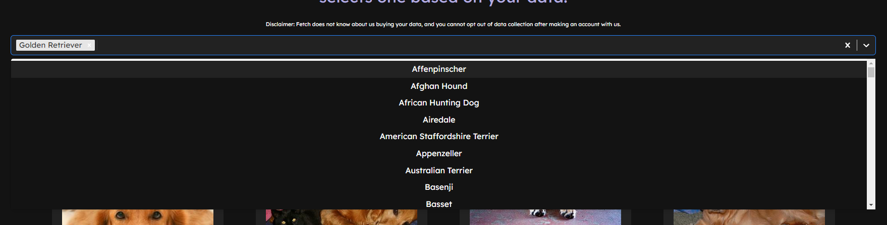
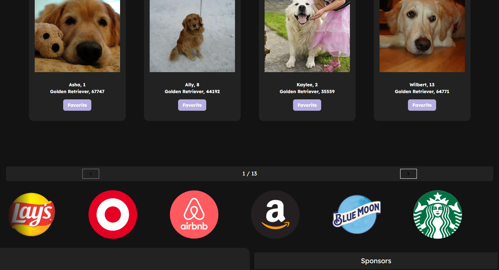
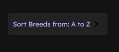
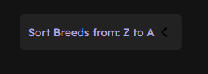
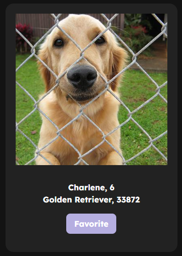

<a name="readme-top"></a>

[![Contributors][contributors-shield]][contributors-url]
[![Forks][forks-shield]][forks-url]
[![Stargazers][stars-shield]][stars-url]
[![Issues][issues-shield]][issues-url]
[![MIT License][license-shield]][license-url]
[![LinkedIn][linkedin-shield]][linkedin-url]


<!-- PROJECT LOGO -->
<br />
<div align="center">
  <a href="https://github.com/henlowgg/fetchseek">
    
  </a>

  <h3 align="center">Rescue.io</h3>

  <p align="center">
    A Doggo Rescue Project Made For Fetch Rewards
    <br />
    <a href="https://github.com/henlowgg/fetchseek"><strong>Explore the GitHub Repo »</strong></a>
    <br />
    <br />
    <a href="https://rescueio.vercel.app/">View Demo</a>
    ·
    <a href="https://github.com/henlowgg/fetchseek/issues">Report Bug</a>
    ·
    <a href="https://github.com/henlowgg/fetchseek/issues">Request Feature</a>
  </p>
</div>


<!-- TABLE OF CONTENTS -->
<details>
  <summary>Table of Contents</summary>
  <ol>
    <li>
      <a href="#about-the-project">About The Project</a>
      <ul>
        <li><a href="#built-with">Built With</a></li>
      </ul>
    </li>
    <li>
      <a href="#getting-started">Getting Started</a>
      <ul>
        <li><a href="#prerequisites">Prerequisites</a></li>
        <li><a href="#installation">Installation</a></li>
      </ul>
    </li>
    <li><a href="#usage">Usage</a></li>
    <li><a href="#roadmap">Roadmap</a></li>
    <li><a href="#contributing">Contributing</a></li>
    <li><a href="#license">License</a></li>
    <li><a href="#contact">Contact</a></li>
    <li><a href="#acknowledgments">Acknowledgments</a></li>
  </ol>
</details>


<!-- ABOUT THE PROJECT -->
## About The Project

[![Rescue.io][product-screenshot]](https://rescueio.vercel.app/)
[![Rescue.io][product-screenshot2]](https://rescueio.vercel.app/)

Welcome to Rescue.io ! I wanted to create something with the newest MicrosoftGPT5 and integrate it into my own ai doggo matching software! Ok all joking aside welcome to the project. As you can see here, I've made a doggo matching website that is able to handle a login, send it to an API endpoint, store that token, and utilize it throughout the application.

Basically the main concept of the application is to be able to match doggos based on searching through breed, pagination, favoriting the doggo, and being able to see a better detailed description of the doggo upon hitting "generate match" button at the bottom of the page!

Was able to get around the concept of something more simple by twisting the idea into a "this is ai software, ai smart, ai match you with doggo from all your data" and spit out a result based on the favorite doggos you had selected. Yes, it is meme, but it is kind of funny. Anyways take a look at the application, and shoot me some feedback! This application was built mainly for Fetch Rewards as a task, however, utilize it however you see fit! I may actually try to implement something like an algorithm to match users based on their data down the road someday when my brain has more than 2 brain cells.

Follow the directions below to get started!

<p align="right">(<a href="#readme-top">back to top</a>)</p>


### Built With

The main technologies used for this peoject. Ran with React, tailwindcss, JavaScript, SCSS and CSS, little bit of HTML, all in all I kept it very vanilla.

* [![React][React.js]][React-url]

<p align="right">(<a href="#readme-top">back to top</a>)</p>


<!-- GETTING STARTED -->
## Getting Started

This is an example on setting up the project locally.
To get a local copy up and running follow these simple example steps.

### Prerequisites

First off if you don't already have it, go ahead and download this to your IDE, I personally use VScode
* npm
  ```sh
  npm install npm@latest -g
  ```

### Installation

_Pretty simple method for cloning the project down and running it._

1. Head to the repo if you aren't already there [https://github.com/henlowgg/fetchseek](https://github.com/henlowgg/fetchseek)
2. Clone the repo with either HTTPS method or SSH key
   ```sh
   git clone https://github.com/henlowgg/fetchseek.git
   ```
   ```sh
   git clone git@github.com:henlowgg/fetchseek.git
   ```
3. Install NPM packages, the package.json should be ready for init after you clone the repo
   ```sh
   npm install
   ```
4. We already have our API endpoint setup in `constants.jsx`, however for reference:
   ```jsx
   const BASE_URL = "https://frontend-take-home-service.fetch.com";
   ```
5. To start the application run:
    ```sh
    npm start
    ```

<p align="right">(<a href="#readme-top">back to top</a>)</p>


<!-- USAGE EXAMPLES -->
## Usage / Task

The application itself was created to streamline the process of being able to Rescue doggos across the country. Of course I decided to meme alot of it i.e., (dogg.io ai software on Microsofts GPT5) but still hey, wouldn't that be cool in the future? Using some modern styling techniques I decided to stick with a darker template, and by following the guidelines set by web accessibility standards, it passed with flying colors. As you can tell from the commit history, this took about 100 hours in one week, and that's not an exaggeration. It was just mainly fun, trial and error, and enjoying it. 

The main points and components of the project were to follow some simple rules and implement them, i.e.;

1. Users must be able to filter by breed



2. Results should be paginated



3. Results should be sorted alphabetically by breed by default. Users should be able to modify this sort to be ascending or descending.
- Asc



- Dec



4. All fields of the Dog object (except for id) must be presented in some form



5. Users should be able to select their favorite dogs from the search results. When finished searching, they should be able to generate a match based on dogs added to the favorites list. A single match will be generated by sending all favorited dog IDs to the /dogs/match endpoint.

#### Additional Requirements

1. Your app should be hosted on the internet where it can be visited and interacted with
- Can be found on [Vercel](https://rescueio.vercel.app/)
2. Your source code should be stored in a git repository and hosted on the internet (i.e. GitHub)
- Can be found in the public [GitHub Repo](https://github.com/henlowgg/fetchseek)
3. You should include any necessary documentation to run your site locally
- Can be found under [Installation]()
4. Email format check on login
- Utilized regex in Login.jsx
5. Layout is responsive
- Hopefully responsive enough!
6. Complete, accurate README
- Hello, README! 
7. Unit tests, use of TypeScript
- Can be found in various tests folders within the src/app/ directory, i.e., src/app/pages/tests/Login.test.tsx (I'd like to point out that this was tricky considering my application is in JS and it specifically asked for TS, alas, still got it done.)
8. Clean Repo with well written readme
- Hi I'm a README, inside a repo!
9. Good application structure
- I would think it is decently structured, considering I tried to follow the AirBnB folder structuring
10. Languages we use: React or Svelte
- React!!!
11. Clean code structure
- Yeah, I'm more of a -10x Dev, but trying to get to 10x as soon as possible!

<p align="right">(<a href="#readme-top">back to top</a>)</p>


<!-- ROADMAP -->
## Roadmap

- [ ] Mobile Auth issue, CORS
    - working on fix to implement, can possibly use express with a proxy server to work with mobile devices better, but for now have to manually disable the "cross site tracking" option within phone settings for successful login, files to fix this issue are currently in project
- [ ] Re-implement doggo animation to successful login (originally had one, stopped fitting theme after a while)
- [x] Add Exact color hex codes Fetch uses
- [x] Clean up code base
- [x] Tests
    - [x] JS
    - [x] TS

See the [open issues](https://github.com/henlowgg/fetchseek/issues) for a full list of proposed features (and known issues).

<p align="right">(<a href="#readme-top">back to top</a>)</p>


<!-- CONTRIBUTING -->
## Contributing

Contributions are what make the open source community such an amazing place to learn, inspire, and create. Any contributions you make are **greatly appreciated**.

If you have a suggestion that would make this better, please fork the repo and create a pull request. You can also simply open an issue with the tag "enhancement".
Don't forget to give the project a star! Thanks again!

1. Fork the Project
2. Create your Feature Branch (`git checkout -b feature/AmazingFeature`)
3. Commit your Changes (`git commit -m 'Add some AmazingFeature'`)
4. Push to the Branch (`git push origin feature/AmazingFeature`)
5. Open a Pull Request

<p align="right">(<a href="#readme-top">back to top</a>)</p>


<!-- LICENSE -->
## License

Distributed under the MIT License. See `LICENSE.txt` for more information.

<p align="right">(<a href="#readme-top">back to top</a>)</p>


<!-- CONTACT -->
## Contact

Link Lee (or you can call me Jack, whichever is fine)

[![LinkedIn][linkedin-shield]][linkedin-url]

Email - henlowdev@gmail.com

Project Link: [https://github.com/henlowgg/fetchseek](https://github.com/henlowgg/fetchseek)

<p align="right">(<a href="#readme-top">back to top</a>)</p>


<!-- ACKNOWLEDGMENTS -->
## Acknowledgments

Some of the resources I found helpful and would like to give credit to.

* [Vercel](https://vercel.com/)
* [Fetch Rewards](https://fetch.com)
* [tailwindCSS](https://tailwindcss.com/)
* [React Select](https://react-select.com/home)
* [React Toastify](https://fkhadra.github.io/react-toastify/introduction/)
* [Axios](https://axios-http.com/)
* [Jest](https://jestjs.io/)
* [TypeScript](https://www.typescriptlang.org/)
* [Node](https://nodejs.org/en)


<p align="right">(<a href="#readme-top">back to top</a>)</p>


<!-- MARKDOWN LINKS & IMAGES -->
<!-- https://www.markdownguide.org/basic-syntax/#reference-style-links -->
[contributors-shield]: https://img.shields.io/github/contributors/henlowgg/fetchseek.svg?style=for-the-badge
[contributors-url]: https://github.com/henlowgg/fetchseek/graphs/contributors
[forks-shield]: https://img.shields.io/github/forks/henlowgg/fetchseek.svg?style=for-the-badge
[forks-url]: https://github.com/henlowgg/fetchseek/network/members
[stars-shield]: https://img.shields.io/github/stars/henlowgg/fetchseek.svg?style=for-the-badge
[stars-url]: https://github.com/henlowgg/fetchseek/stargazers
[issues-shield]: https://img.shields.io/github/issues/henlowgg/fetchseek.svg?style=for-the-badge
[issues-url]: https://github.com/henlowgg/fetchseek/issues
[license-shield]: https://img.shields.io/github/license/henlowgg/fetchseek.svg?style=for-the-badge
[license-url]: https://github.com/henlowgg/fetchseek/blob/master/LICENSE.txt
[linkedin-shield]: https://img.shields.io/badge/-LinkedIn-black.svg?style=for-the-badge&logo=linkedin&colorB=555
[linkedin-url]: https://linkedin.com/in/henlow
[product-screenshot]: ./src/assets/images/rescueioscreenshot.png
[product-screenshot2]: ./src/assets/images/rescueioscreenshot2.png
[React.js]: https://img.shields.io/badge/React-20232A?style=for-the-badge&logo=react&logoColor=61DAFB
[React-url]: https://reactjs.org/